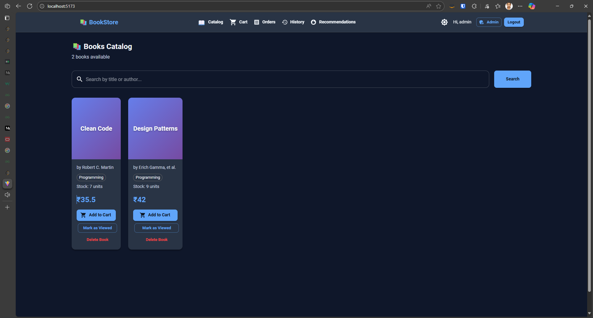
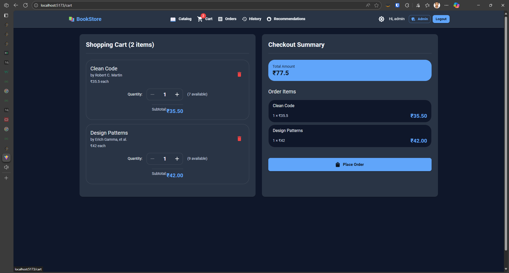
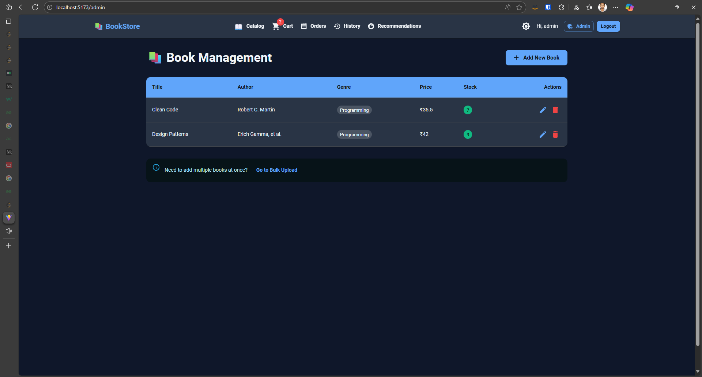

# 📚 Online Bookstore

A full-stack online bookstore application with React frontend and Spring Boot backend.

## Features

- Shopping cart with real-time stock validation
- User authentication (Admin & Customer roles)
- Order management
- Browsing history
- Book recommendations
- Dark mode support
- Responsive design with Material-UI

## Tech Stack

**Frontend:**
- React 18
- Material-UI v5
- React Router v6
- Vite
- React Toastify

**Backend:**
- Spring Boot 3.2
- DynamoDB (AWS SDK v2)
- Java 17
- Maven

## Quick Start

### Prerequisites
- Node.js v18+
- Java 17+
- Maven
- DynamoDB Local (for development)

### Backend Setup

```bash
# Start DynamoDB Local (port 8000)
java -Djava.library.path=./DynamoDBLocal_lib -jar DynamoDBLocal.jar -sharedDb

# Run Spring Boot
cd Online_Book_Store
mvn spring-boot:run
```

Backend runs on: `http://localhost:8080`

### Frontend Setup

```bash
cd bookstore-ui
npm install
npm run dev
```

Frontend runs on: `http://localhost:5173`

## 👤 Demo Credentials

**Admin Account:**
- Username: `admin`
- Password: `admin123`

## 📂 Project Structure

```
Online_Book_Store/
├── src/main/java/com/bookstore/     # Backend Java code
│   ├── api/                          # REST controllers
│   ├── config/                       # Configuration
│   └── spring/                       # Spring components
├── bookstore-ui/                     # Frontend React app
│   └── src/
│       ├── components/               # React components
│       ├── pages/                    # Page components
│       └── api.js                    # API client
└── pom.xml                           # Maven configuration
```

## Current Status

- [X] User authentication and authorization
- [X] Book catalog with search
- [X] Shopping cart functionality
- [X] Order placement and history
- [X] Admin panel for book management
- [X] Bulk upload for books
- [X] Dark mode
- [X] Responsive UI

## Roadmap

- [ ] User profile management
- [ ] Book reviews and ratings
- [ ] Advanced search filters
- [ ] Payment integration
- [ ] Email notifications
- [ ] Wishlists

## Screenshots





## 📄 License

MIT License

## 👨‍💻 Author

Aditya Shubham